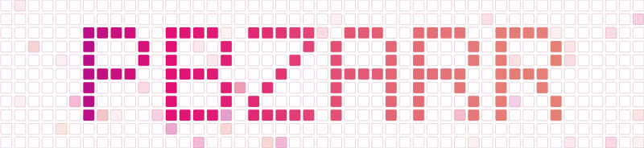

<picture>
  <source media="(prefers-color-scheme: dark)" srcset="docs/assets/pbzarr-grid-dark.svg">
  
</picture>

# pbzarr

## Synopsis

pbzarr is an array format for per-base genomic data. A track holds one value per base (depth, signal, a mask) for one sample or a whole cohort. A `.pbz` collection groups related tracks.

The arrays are Zarr v3, so xarray, Dask, and other Zarr tools can read them directly. A question such as "mean depth across all samples in these windows" then becomes one array operation.

pbzarr supports:

- fast reads over genomic regions
- one value or many labeled values at each base
- compression across samples or other columns
- parallel calculations with xarray and Dask
- d4, bigWig, BED, and BAM/CRAM imports

The project provides Rust and Python libraries and the `pbz` command-line tool.

## Motivation

Many genomic measurements assign one value to every base in a genome: sequencing depth, assay signal, conservation scores, accessibility masks. Formats like d4, bigWig, and BED handle these values well for a single sample. They compress them into a small file and read regions fast.

Most analyses, however, involve many samples at once: a population study, a case-control panel, every individual in a resequencing project. With one file per sample, a cohort of 200 samples is 200 files.

Cohort questions are per-position questions across samples: the mean depth at each site, or the sites covered at 10x in at least 90% of samples. Every such question becomes the same loop: open each file, read the same region again, join the results. This loop is slow at genome scale, and its cost increases with each added sample.

pbzarr stores the cohort as one two-dimensional array: one row per base, one column per sample. Values from all samples at a position sit next to each other on disk, so they compress together. Per-position questions become array operations that run in parallel across all positions and samples.

## Data model

pbzarr uses the [dataset model of xarray](https://docs.xarray.dev/en/stable/user-guide/data-structures.html#dataset). In this model, a dataset holds many variables, and the variables share the same coordinates. In pbzarr, the collection is the dataset, each track is one variable, and the coordinates are genomic positions.

A track has at most two dimensions: genomic position and one explicitly labeled column axis. The column axis is homogeneous, so every column shares the track's data type, fill value, and compression settings. It can label samples from several input sources, or label BED columns that a schema groups into one track. Those two axes cannot appear together because that would require a rank-3 track; grouped BED-column imports therefore accept one source only. When values need different data types or settings, each kind goes into its own track. For example, depth, mapping quality, and a mask become three tracks in one collection.

Each track records its own genome. Tracks that record the same genome have the same length and the same base order, so pbzarr can open them together and calculate across them. See [format](#format) for more details.

## Python examples

### Import d4 files

```python
import pbzarr

pbzarr.create_store("depth.pbz")
pbzarr.import_d4(
    "depth.pbz",
    "depth",
    [("brain.d4", "brain"), ("liver.d4", "liver")],
    column_dim="sample",
)
```

This creates a `depth` track with one row per genomic position and one column per sample.

### Read a region

```python
depth = pbzarr.open("depth.pbz/depth")

window = depth.pbz.region("chr1:100000-101000")
brain = depth.pbz.region("chr1:100000-101000", column="brain")

values = window.compute()
```

pbz uses zero-based, half-open coordinates.

### Calculate statistics over regions

```python
peaks = [
    ("chr1", 100000, 100200),
    ("chr1", 150000, 150300),
    ("chr2", 200000, 200150),
]

peak_means = depth.pbz.reduce_regions(peaks, "mean")
result = peak_means.compute()
```

The result has one mean for each peak and sample. Other reductions include `sum`, `min`, `max`, `count`, `std`, `var`, `median`, and `quantile`.

Dask keeps reads and calculations lazy until `compute()`. The computed result must still fit in memory.

### Open a collection

Opening a track returns an `xarray.Dataset`. Opening a collection returns an `xarray.DataTree` whose children are tracks.

```python
study = pbzarr.open("study.pbz")

depth = study["depth"].to_dataset()
mask = study["mask"].to_dataset()
```

Each track records its own genome. Tracks with matching genomes can be used together.

### Import other files

```python
pbzarr.create_store("signals.pbz")
pbzarr.import_bigwig("signals.pbz", "signal", "sample.bw")

pbzarr.create_store("scores.pbz")
pbzarr.import_bed(
    "scores.pbz",
    "score",
    "sites.bed.gz",
    column="score",
    dtype="float32",
    genome="genome.fai",
)
```

BED imports need a `.fai` or chromosome-sizes file because BED does not record chromosome lengths.

## Format

A `.pbz` collection is a Zarr v3 directory. Each child directory is a track.

```text
study.pbz/
├── zarr.json
├── depth/
│   ├── zarr.json
│   ├── values
│   ├── offsets
│   ├── contigs
│   └── sample
└── mask/
    ├── zarr.json
    ├── values
    ├── offsets
    └── contigs
```

Each track group holds a fixed set of arrays:

- `values`: the data, with contigs concatenated along the position axis in genome order. The shape is `(L,)` for a track without columns or `(L, n_columns)` with them, where `L` is the total length of the track's genome.
- `contigs`: the contig names, in the same order.
- `offsets`: an int64 index with one entry more than `contigs`. `offsets[i]` is the first row of contig `i`, so `offsets[i+1] - offsets[i]` is its length and the last entry equals `L`.
- a column-label array, named after the column dimension (`sample` above). Present only when the track has columns.

Every track declares one data type and one fill value, and positions with no data hold the fill value. The `values` array is chunked and compressed with Blosc (zstd with byte shuffle) by default; imports can override the codec pipeline and chunk grid with standard Zarr v3 metadata (`--codecs` on the CLI, `codecs=` in Python). For a track with columns, chunks extend across columns as well as positions, so values from different samples compress together.

Region reads are index arithmetic. The rows for `chr2:10-20` are `offsets[i] + 10` up to `offsets[i] + 20`, where `i` is the index of chr2 in `contigs`. All coordinates are zero-based and half-open.

A track's genome is the list of `(contig name, length)` pairs defined by `contigs` and `offsets`. There is no genome at the collection level: each track carries its own, and two tracks in one collection can cover different genomes. Each track also stores a genome checksum, the MD5 of its contig names and lengths sorted by name. Two tracks record the same genome exactly when their checksums are equal, and pbzarr applies this test whenever it aligns or combines tracks. A track can also store a genome name such as `hg38`, but the name is a human-readable label and has no part in the checksum.

A track's `zarr.json` holds this metadata: the format version, the genome checksum and name, the coordinate convention, and the names of the index arrays. pbzarr writes the metadata block last during an import, so the block also marks the track as complete. A track group without it is incomplete, and opening a collection skips it.

See the [design document](docs/DESIGN.md) for the full file rules and Rust API.

## Status

pbzarr is under active development and has not reached version 1.0. The API and file rules can change. Remote writes and variable chunk sizes are planned.

## Links

- [Rust API](https://docs.rs/pbzarr)
- [Design](docs/DESIGN.md)
- [d4](https://github.com/38/d4-format)
- [Motivating issues](https://github.com/38/d4-format/issues/82): mask generation, [cross-sample compression](https://github.com/38/d4-format/issues/64), and [per-base sample statistics](https://github.com/cademirch/clam/issues/25)
