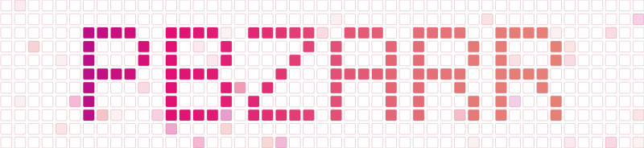

<picture>
  <source media="(prefers-color-scheme: dark)" srcset="docs/assets/pbzarr-grid-dark.svg">
  
</picture>

# pbzarr

## What is this?

pbzarr is a library for storing and analyzing genomic measurements at base-pair resolution. It stores measurements in two-dimensional arrays: one dimension for genomic position, and another for samples or other labels. You can run calculations across either dimension or both.

pbzarr uses [Zarr](https://zarr.dev/), an existing format for compressed arrays. It adds conventions for genomic coordinates and column labels, plus tools to import and analyze the data.

## Motivation

Most bioinformatics files (BAM, BED, bigWig) hold data for one sample. And this makes sense, because most primary bionformatics analyses (i.e alignment) are sample independent. But many downstream analyses need comparisons across samples, over the whole genome or in regions of interest. That means opening each sample's files, reading the relevant data, performing computations, and storing the result.

Often these analyses are exploratory. We run them several times as we decide which samples to include, which regions to look at, or where to set a threshold. With a few regions or a small sample set, this is not that big of a deal. But as cohorts and region sets grow, more work goes into reading the files and bringing the measurements together. During exploratory analysis, we can repeat that work every time we ask a slightly different question, even though the underlying measurements have not changed.

pbzarr builds on the idea that these analyses often need the same two-dimensional array: one dimension for genomic position, and another for samples. pbzarr builds this array for the whole genome once and stores it in compressed chunks using [Zarr](https://zarr.dev/). Each analysis can then read the regions and samples it needs, without rebuilding the array from individual sample files.

This also has a few useful side effects:

- [Xarray](https://docs.xarray.dev/en/stable/user-guide/data-structures.html) lets us attach genomic positions, sample names, and other labels to the dimensions, and organize different measurements together.
- [Dask](https://docs.dask.org/en/stable/array.html) lets us run calculations in parallel, on one machine or across a cluster.
- [Zarr](https://zarr.readthedocs.io/en/stable/user-guide/storage/) supports local and cloud storage. We can read the chunks we need from the cloud without downloading the whole dataset.

## Data model

pbzarr uses the [dataset model of xarray](https://docs.xarray.dev/en/stable/user-guide/data-structures.html#dataset). In this model, a dataset holds many variables, and the variables share the same coordinates. In pbzarr, the collection is the dataset, each track is one variable, and the coordinates are genomic positions.

A track has at most two dimensions: genomic position and one explicitly labeled column axis. The column axis is homogeneous, so every column shares the track's data type, fill value, and compression settings. It can label samples from several input sources, or label BED columns that a schema groups into one track. Those two axes cannot appear together because that would require a rank-3 track; grouped BED-column imports therefore accept one source only. When values need different data types or settings, each kind goes into its own track. For example, depth, mapping quality, and a mask become three tracks in one collection.

Each track records its own genome. Tracks that record the same genome have the same length and the same base order, so pbzarr can open them together and calculate across them. See [format](#format) for more details.

## Python examples

### Import d4 files

```python
import pbzarr

pbzarr.create_store("depth.pbz")
pbzarr.import_d4(
    "depth.pbz",
    "depth",
    [("brain.d4", "brain"), ("liver.d4", "liver")],
    column_dim="sample",
)
```

This creates a `depth` track with one row per genomic position and one column per sample.

### Read a region

```python
depth = pbzarr.open("depth.pbz/depth")

window = depth.pbz.region("chr1:100000-101000")
brain = depth.pbz.region("chr1:100000-101000", column="brain")

values = window.compute()
```

pbz uses zero-based, half-open coordinates.

### Calculate statistics over regions

```python
peaks = [
    ("chr1", 100000, 100200),
    ("chr1", 150000, 150300),
    ("chr2", 200000, 200150),
]

peak_means = depth.pbz.reduce_regions(peaks, "mean")
result = peak_means.compute()
```

The result has one mean for each peak and sample. Other reductions include `sum`, `min`, `max`, `count`, `std`, `var`, `median`, and `quantile`.

Dask keeps reads and calculations lazy until `compute()`. The computed result must still fit in memory.

### Open a collection

Opening a track returns an `xarray.Dataset`. Opening a collection returns an `xarray.DataTree` whose children are tracks.

```python
study = pbzarr.open("study.pbz")

depth = study["depth"].to_dataset()
mask = study["mask"].to_dataset()
```

Each track records its own genome. Tracks with matching genomes can be used together.

### Import other files

```python
pbzarr.create_store("signals.pbz")
pbzarr.import_bigwig("signals.pbz", "signal", "sample.bw")

pbzarr.create_store("scores.pbz")
pbzarr.import_bed(
    "scores.pbz",
    "sites.bed.gz",
    genome="genome.fai",
    track="score",
    column="score",
    dtype="float32",
)
```

BED imports need a `.fai` or chromosome-sizes file because BED does not record chromosome lengths.

## CLI examples

Import a bigWig file into a `signal` track:

```sh
pbz import bigwig -o signal.pbz --track signal sample.bw
```

The import reads chromosome lengths from the bigWig header and stores values as `float32`. Uncovered bases contain `NaN`.

Import several files as labeled columns:

```sh
pbz import bigwig -o cohort.pbz --track signal -c sample brain.bw:brain liver.bw:liver
```

All sources must describe the same genome. Without explicit labels, the import uses each file's stem as its column label.

The command accepts the same import options as `pbz import d4`. These include `--file-list`, `--threads`, chunk and shard sizes, `--codecs`, `--scales`, and `--no-progress`.

Preview the tracks and storage layout without writing a store:

```sh
pbz import bigwig -o cohort.pbz --track signal --file-list sources.tsv --dry-run
```

The source list contains one path per line, optionally followed by a tab and a label. If any source has a label, all sources must have labels.

## Format

A `.pbz` collection is a Zarr v3 directory. Each child directory is a track.

```text
study.pbz/
├── zarr.json
├── depth/
│   ├── zarr.json
│   ├── values
│   ├── offsets
│   ├── contigs
│   └── sample
└── mask/
    ├── zarr.json
    ├── values
    ├── offsets
    └── contigs
```

Each track group holds a fixed set of arrays:

- `values`: the data, with contigs concatenated along the position axis in genome order. The shape is `(L,)` for a track without columns or `(L, n_columns)` with them, where `L` is the total length of the track's genome.
- `contigs`: the contig names, in the same order.
- `offsets`: an int64 index with one entry more than `contigs`. `offsets[i]` is the first row of contig `i`, so `offsets[i+1] - offsets[i]` is its length and the last entry equals `L`.
- a column-label array, named after the column dimension (`sample` above). Present only when the track has columns.

Every track declares one data type and one fill value, and positions with no data hold the fill value. The `values` array is chunked and compressed with Blosc (zstd with byte shuffle) by default; imports can override the codec pipeline and chunk grid with standard Zarr v3 metadata (`--codecs` on the CLI, `codecs=` in Python). For a track with columns, chunks extend across columns as well as positions, so values from different samples compress together.

Region reads are index arithmetic. The rows for `chr2:10-20` are `offsets[i] + 10` up to `offsets[i] + 20`, where `i` is the index of chr2 in `contigs`. All coordinates are zero-based and half-open.

A track's genome is the list of `(contig name, length)` pairs defined by `contigs` and `offsets`. There is no genome at the collection level: each track carries its own, and two tracks in one collection can cover different genomes. Each track also stores a genome checksum, the MD5 of its contig names and lengths sorted by name. Two tracks record the same genome exactly when their checksums are equal, and pbzarr applies this test whenever it aligns or combines tracks. A track can also store a genome name such as `hg38`, but the name is a human-readable label and has no part in the checksum.

A track's `zarr.json` holds this metadata: the format version, the genome checksum and name, the coordinate convention, and the names of the index arrays. pbzarr writes the metadata block last during an import, so the block also marks the track as complete. A track group without it is incomplete, and opening a collection skips it.

See the [design document](docs/DESIGN.md) for the full file rules and Rust API.

## Status

pbzarr is under active development and has not reached version 1.0. The API and file rules can change. Remote writes and variable chunk sizes are planned.

## Links

- [Rust API](https://docs.rs/pbzarr)
- [Design](docs/DESIGN.md)
- [d4](https://github.com/38/d4-format)
- [Motivating issues](https://github.com/38/d4-format/issues/82): mask generation, [cross-sample compression](https://github.com/38/d4-format/issues/64), and [per-base sample statistics](https://github.com/cademirch/clam/issues/25)

## Development note

The per-base Zarr format that pbzarr standardizes was first prototyped by hand in [clam](https://github.com/cademirch/clam), where the initial concepts (the contig-major layout, cohort-shaped tracks, and the zarr/ndarray I/O path) were fleshed out before AI tooling was introduced. pbzarr lifts those concepts into a dedicated, spec-driven library.

From that point, development of pbzarr was heavily assisted by Claude (Anthropic), accelerating the library implementation, d4 import, tests, and documentation. The architecture, domain knowledge, and direction remain the author's own; Claude was used as an accelerant, not an author.
